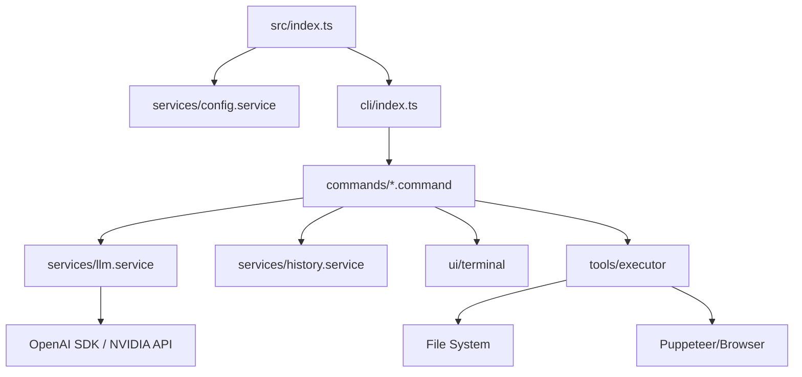

# 🤖 Relatório de Engenharia Reversa: luxyie.ai-cli

Este documento contém uma análise técnica exaustiva do sistema **Luxyie AI CLI**, reconstruído a partir do código-fonte fornecido.

---

## 1. 📁 Estrutura do Projeto

Abaixo, a árvore completa de diretórios e arquivos relevantes mapeados no sistema:

```text
luxyie.ai-cli/
├── assets/                  # Ativos visuais (logos, etc.)
├── bundle/                  # Saída do bundle (luxyie.cjs)
├── scripts/                 # Scripts de build e pós-instalação
├── src/
│   ├── cli/
│   │   └── index.ts         # Configuração do Commander e Entry Point CLI
│   ├── commands/
│   │   ├── ask.command.ts       # Lógica do comando 'ask'
│   │   ├── chat.command.ts      # Lógica central do loop de chat
│   │   ├── clear.command.ts     # Limpeza de histórico
│   │   ├── config.command.ts    # Gestão de configurações
│   │   ├── history.command.ts   # Visualização de sessões passadas
│   │   ├── model.command.ts     # Seleção de modelos AI
│   │   ├── token-limit.command.ts # Gestão de limites de contexto
│   │   └── update.command.ts    # Sistema de auto-update
│   ├── prompts/
│   │   └── system-prompt.ts # Definição das instruções do sistema
│   ├── services/
│   │   ├── config.service.ts    # Persistência de config (JSON)
│   │   ├── history.service.ts   # Persistência de conversas (JSON)
│   │   ├── llm.service.ts       # Cliente de integração com NVIDIA/OpenAI
│   │   ├── models.ts            # Definição e metadados dos modelos
│   │   └── update.service.ts    # Lógica de verificação de versão
│   ├── tools/
│   │   └── executor.ts      # Engine de execução de ferramentas (Agente)
│   ├── types/
│   │   └── index.ts         # Definições de interfaces TS
│   ├── ui/
│   │   ├── components.ts    # Componentes visuais (banners, cores)
│   │   ├── renderer.ts      # Renderização de Markdown/Markdown Terminal
│   │   ├── spinner.ts       # Gestão de indicadores de carregamento
│   │   └── terminal.ts      # Abstração de I/O do terminal
│   ├── utils/
│   │   ├── index.ts         # Exportação central de utilitários
│   │   ├── git.ts           # Integração com comandos Git
│   │   ├── session-manager.ts # Gestão de estado de sessão
│   │   └── ... (utilitários diversos)
│   └── index.ts             # Bootloader principal do sistema
├── tests/                   # Suíte de testes (Jest)
├── package.json             # Manifesto do projeto
├── tsconfig.json            # Configuração TypeScript
└── README.md                # Documentação do usuário
```

---

## 2. 🧩 Classificação de Arquivos

| Arquivo/Pasta | Classificação | Responsabilidade |
| :--- | :--- | :--- |
| `src/index.ts` | **Entry Point** | Inicializa o sistema e decide se inicia o chat direto ou via CLI. |
| `src/cli/index.ts` | **Loader / Handler** | Configura o `commander` e registra todos os subcomandos. |
| `src/commands/*.ts` | **Command** | Implementa a lógica específica de cada comando do usuário. |
| `src/services/llm.service.ts` | **Service / Connector** | Abstrai a comunicação com as APIs de IA (NVIDIA/OpenAI). |
| `src/services/config.service.ts`| **Config / Service** | Gere a persistência de preferências do usuário no disco. |
| `src/tools/executor.ts` | **Handler / Service** | O "cérebro" do agente; executa ações no mundo real (FS, Web, CMD). |
| `src/ui/*.ts` | **Utility (UI)** | Cuida da estética, cores, animações e renderização do terminal. |
| `src/utils/*.ts` | **Utility** | Funções puras e auxiliares reutilizáveis em todo o sistema. |
| `src/types/index.ts` | **Types** | Contrato de dados entre os módulos. |

---

## 3. 📄 Análise Detalhada por Componente Core

### **A. Entry Point (`src/index.ts`)**
- **Função:** Ponto de ignição.
- **Lógica:** Inicializa o `configManager`. Se rodado sem argumentos, chama `startChat` imediatamente. Caso contrário, delega para o `commander` processar os argumentos.
- **Conexões:** `configManager`, `cli/index.ts`, `ui/components.ts`.

### **B. CLI Handler (`src/cli/index.ts`)**
- **Função:** Orquestrador de interface de comando.
- **Responsabilidade:** Define a sintaxe da CLI (`ask`, `chat`, `config`, `history`). Gerencia sinais de processo (`SIGINT`) para encerramento gracioso.
- **Dependências:** `commander`, `updateService`.

### **C. LLM Service (`src/services/llm.service.ts`)**
- **Função:** Gateway de Inteligência.
- **Inputs:** Array de `ChatMessage`, opções de streaming, definições de ferramentas (`ToolDefinition`).
- **Outputs:** Stream de tokens ou objeto de resposta final contendo conteúdo e `tool_calls`.
- **Diferencial:** Suporta detecção de "Reasoning" (Pensamento) e formata a saída em tempo real.

### **D. Tool Executor (`src/tools/executor.ts`)**
- **Função:** Agentic Brain.
- **Responsabilidade:** Executar as `function_calls` retornadas pela IA.
- **Ferramentas Suportadas:**
    - `list_directory`: Exploração de arquivos com proteção de profundidade.
    - `run_command`: Execução de shell (PowerShell no Windows, Bash no Linux).
    - `web_viewer`: Automação completa de browser via Puppeteer.
    - `read_image`: Visão computacional via API NVIDIA.

---

## 4. 🔄 Fluxo de Execução Real

1.  **Boot:** O usuário digita `luxyie`. O `node` executa `index.js`.
2.  **Inicialização:** O `config.service` carrega o arquivo `.json` da pasta home do usuário.
3.  **Carregamento:**
    - Se houver argumentos: O `commander` mapeia para a classe de comando correspondente (ex: `ChatCommand`).
    - Se for chat direto: Inicia o loop de interação.
4.  **Registro:** O `update.service` inicia uma verificação assíncrona de nova versão em background.
5.  **Execução (Loop de Chat):**
    - `ui.ask()` aguarda o prompt do usuário.
    - O prompt é enviado para o `llm.service`.
    - Se a IA retornar uma ferramenta, o `executor.ts` realiza a ação (ex: lê um arquivo).
    - O resultado da ferramenta volta para a IA como contexto.
6.  **Resposta:** O `renderer.ts` formata o Markdown e exibe no terminal com cores e estilos.

---

## 5. 🔗 Mapa de Dependências



---

## 6. 🧠 Arquitetura do Sistema

- **Padrão:** **Modular Service-Oriented Architecture (SOA)** no contexto de CLI.
- **Camadas:**
    1.  **Interface (UI/CLI):** Desacoplada da lógica de negócios, foca apenas em entrada/saída.
    2.  **Lógica de Comando (Commands):** Controladores que coordenam os serviços.
    3.  **Serviços (Services):** Abstrações de baixo nível (Config, DB/History, LLM).
    4.  **Agente (Tools):** Camada de execução externa (Sandboxing parcial via permissões).
- **Escalabilidade:** Altamente modular; adicionar um novo comando ou uma nova ferramenta requer apenas a criação de um novo arquivo seguindo o padrão.

---

## 7. 🔁 Entrada e Saída (I/O)

- **Entradas:**
    - Prompts de texto do usuário (via `stdin`).
    - Arquivos locais (via `read_file`).
    - Dados da Web (via `web_fetch`).
    - Imagens (Base64).
    - Variáveis de ambiente (`NVIDIA_API_KEY`).
- **Processamento:** Orquestração entre LLM (NVIDIA Builds) e o Tool Executor.
- **Saídas:**
    - Texto formatado em Markdown Terminal.
    - Arquivos gravados no disco (`write_file`).
    - Comandos executados no Shell.
    - Logs coloridos e indicadores de progresso (`ora`).

---

## 8. 🗺️ Diagrama Visual (Estruturado)

```text
[ LUX YIE . A I - C L I ]
 ├── [ Inicialização ]
 │    └── src/index.ts (Boot & Route)
 ├── [ Interface CLI ]
 │    └── src/cli/index.ts (Commander Configuration)
 ├── [ Módulos de Comando ]
 │    ├── chat.command.ts (Main Loop)
 │    ├── ask.command.ts (One-off Prompt)
 │    └── config.command.ts (Settings UI)
 ├── [ Agente Autônomo ]
 │    └── src/tools/executor.ts (Action Engine)
 ├── [ Infraestrutura ]
 │    ├── llm.service.ts (AI Bridge)
 │    ├── history.service.ts (Data Persistence)
 │    └── config.service.ts (User Prefs)
 └── [ Apresentação ]
      ├── renderer.ts (Markdown to ANSI)
      └── components.ts (Styling Tokens)
```

---

## 9. ⚠️ Diagnóstico Técnico

Após análise profunda, foram identificados os seguintes pontos críticos:

1.  **Acoplamento de I/O:** Algumas lógicas de UI (`console.log`) estão espalhadas dentro de classes de comando, o que dificulta testes unitários puros.
2.  **Segurança do Shell:** O comando `run_command` não possui uma camada de "sandbox" robusta; ele executa o comando com as permissões do usuário que iniciou a CLI.
3.  **Gestão de Memória:** O uso do Puppeteer para `web_viewer` é pesado para uma CLI. Embora funcional, o ciclo de vida do browser (`cleanup`) precisa ser monitorado rigorosamente para evitar processos zumbis.
4.  **Tratamento de Erros:** Em `llm.service.ts`, o tratamento de erros da rede (Axios) é resiliente, mas a lógica de retry não está implementada de forma explícita.

---

## 10. 🚀 Sugestões de Melhoria (Roadmap Sênior)

1.  **Refatoração para Repository Pattern:** Isolar a persistência de `history` em um repositório para permitir trocar JSON por SQLite no futuro, visando performance em históricos gigantes.
2.  **Permissões Granulares:** Implementar um sistema de confirmação (Y/N) para ferramentas destrutivas como `run_command` e `write_file`, similar ao que o `Aider` ou `Claude Engineer` fazem.
3.  **Abstração de Provider:** Atualmente o código está muito focado em NVIDIA/OpenAI. Criar uma interface `ILLMProvider` permitiria suporte fácil a Anthropic, Google Gemini ou Ollama Local.
4.  **Otimização de Bundle:** O uso de `esbuild` no script de build é excelente, mas a inclusão de dependências pesadas como `puppeteer` como `optionalDependency` é uma decisão acertada que deve ser mantida para manter o core leve.
5.  **Testes de Integração:** Adicionar testes que simulem o loop de chat (`nock` para mockar a API de IA) para garantir que as `tool_calls` estão sendo mapeadas corretamente.

---

**Análise concluída com sucesso.**
*Assinado: Advanced Code Intelligence Engine V3 / Antigravity*
